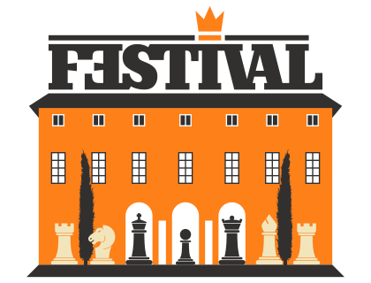

# 37° Festival "Comune di Robecchetto con Induno"

### REGLAMENTO

- La manifestación, realizada con el patrocinio del [ayuntamiento de Robecchetto con Induno](http://www.comune.robecchetto-con-induno.mi.it/) y la contribución de la [sociedad Ecologica Naviglio](http://www.ecologicanaviglio.it), comprende tres torneos de ajedrez válidos para la actualización del puntaje Elo Estándar FIDE.
- Los tres torneos se desarrollan con sistema suizo a seis rondas. Cada jugador podrá solicitar unas tablas por incomparecencia según las modalidades definidas por el RTF de la FSI.
- Estos son los criterios de desempate adoptados: REP (rondas en las que se eligió jugar), Buchholz cut 1, Sonneborn-Berger y A.R.O. A los solos efectos de este último desempate técnico el Elo Italia es equiparado al Elo FIDE.

### CALENDARIO DE JUEGO

<table>
  <tr>
    <th>FECHA</th>
    <th>MAGISTRAL & OPEN FIDE A</th>
    <th>OPEN FIDE B</th>
  </tr>
  <tr>
    <th rowspan="3">Viernes 26 diciembre 2025</th>
    <td>15:15 - cierre inscripciones y control presencias</td>
    <td>14:30 - cierre inscripciones y control presencias</td>
  </tr>
  <tr>
    <td>16:00 - 1ª ronda</td>
    <td>15:15 - 1ª ronda</td>
  </tr>
  <tr>
    <td></td>
    <td>17:30 - 2ª ronda</td>
  </tr>
  <tr>
    <th rowspan="3">Sábado 27 diciembre 2025</th>
    <td>09:30 - 2ª ronda</td>
    <td>10:30 - 3ª ronda</td>
  </tr>
  <tr>
    <td>15:00 - 3ª ronda</td>
    <td>14:15 - 4ª ronda</td>
  </tr>
  <tr>
    <td></td>
    <td>16:30 - 5ª ronda</td>
  </tr>
  <tr>
    <th rowspan="3">Domingo 28 diciembre 2025</th>
    <td>09:30 - 4ª ronda</td>
    <td>10:30 - 6ª ronda</td>
  </tr>
    <tr>
    <td></td>
    <td>Al término - Premiaciones</td>
  </tr>
    <tr>
    <td colspan="2">14:45 - Open Semirrápido</td>
  </tr>
  <tr>
    <th rowspan="3">Lunes 29 diciembre 2025</th>
    <td>09:30 - 5ª ronda</td>
    <td></td>
  </tr>
  <tr>
    <td>15:00 - 6ª ronda </td>
    <td></td>
  </tr>
    <tr>
    <td>Al término - Premiaciones</td>
    <td></td>
  </tr>
  <tr>
    <td colspan="3">
      El jugador que llegue al tablero con más de 30 minutos de retraso sobre el horario de inicio establecido de la sesión de juego perderá la partida.
    </td>
  </tr>
</table>

### REEMBOLSOS DE GASTOS Y OTROS PREMIOS

<table>
  <tr>
    <th>CLASIFICACIÓN</th>
    <th>MAGISTRAL</th>
    <th>OPEN FIDE A</th>
    <th>OPEN FIDE B</th>
  </tr>
  <tr>
    <td><b>1°</b></td>
    <td>300,00€ + copa</td>
    <td>150,00€ + copa</td>
    <td>120,00€ + copa</td>
  </tr>
  <tr>
    <td><b>2°</b></td>
    <td>200,00€ + copa</td>
    <td>100,00€ + copa</td>
    <td>80,00€ + copa</td>
  </tr>
  <tr>
    <td><b>3°</b></td>
    <td>150,00€ + copa</td>
    <td>70,00€ + copa</td>
    <td>60,00€ + copa</td>
  </tr>
  <tr>
    <td><b>4°</b></td>
    <td>100,00€</td>
    <td>50,00€</td>
    <td>40,00€</td>
  </tr>
  <tr>
    <td><b>5°-6°</b></td>
    <td>75,00€</td>
    <td>35,00€</td>
    <td>paquete productos alimentarios</td>
  </tr>
  <tr>
    <th>PREMIOS DE CATEGORÍA (*)</th>
    <th>MAGISTRAL</th>
    <th>OPEN FIDE A</th>
    <th>OPEN FIDE B</th>
  </tr>
  <tr>
    <td><b>1° &lt;2000</b></td>
    <td>60,00€</td>
    <td></td>
    <td></td>
  </tr>
  <tr>
    <td><b>2°-3° &lt;2000</b></td>
    <td>50,00€</td>
    <td></td>
    <td></td>
  </tr>
  <tr>
    <td><b>1° mayores 65</b></td>
    <td>paquete productos alimentarios</td>
    <td>paquete productos alimentarios</td>
    <td>paquete productos alimentarios</td>
  </tr>
  <tr>
    <td><b>1ª mujer</b></td>
    <td></td>
    <td></td>
    <td>copa en memoria de Graziella Monzeglio</td>
  </tr>
  <tr>
    <td colspan="4">(*) no acumulables</td>
  </tr>
</table>

### INFORMACIÓN E INSCRIPCIONES

<table>
  <tr>
    <td></td>
    <th>MAGISTRAL & OPEN FIDE A</th>
    <th>OPEN FIDE B</th>
  </tr>
  <tr>
    <th>Cuota de Inscripción</th>
    <td>50,00€ (gratis para jugadores con Elo Estándar &gt; 2299)</td>
    <td>35,00€</td>
  </tr>
  </table>

- 5,00€ de descuento no acumulables para los veteranos (nacidos antes del 31.12.1960), las mujeres y los jugadores nacidos después del 31.12.2006.
- 5,00€ de descuento adicionales para los socios del club organizador.
- Se requiere preinscripción por teléfono o completando el <a href="https://vesus.org/event/???" target="_blank">formulario</a> correspondiente en VeSus antes del 22 de diciembre.

<table>
  <tr>
    <th>Responsable</th>
    <th>Móvil</th>
    <th>Correo electrónico</th>
  </tr>
  <tr>
    <td>Simone Rolfi</td>
    <td>+39&nbsp;3465755408</td>
    <td><a href="mailto:info@cavalliesegugi.com">info@cavalliesegugi.com</a>
    </td>
  </tr>
</table>

### SEDE DE JUEGO

Hotel Restaurante DA MARIUCCIA en vía don Pozzi 43 en Malvaglio di Robecchetto con Induno.

- Tel. 0331 875546
- Fax: 0331 876133
- Sitio web: <a href="http://www.damariuccia.it" target="_blank">http://www.damariuccia.it</a>
- En la sala de juego está prohibido fumar.
- La organización se reserva el derecho de aceptar un <strong>máximo de 132 inscripciones</strong>. Sin embargo, este límite podrá ser aumentado si la sede de juego lo permite.
- Es posible llevar teléfonos móviles (como otros instrumentos electrónicos) al área del torneo solo a condición de que estén completamente apagados y permanezcan físicamente separados de los jugadores (por ej. en una bolsa); en caso contrario el árbitro aplicará las sanciones previstas por el reglamento FIDE.

### TIEMPO DE REFLEXIÓN

<table>
  <tr>
    <th>MAGISTRAL</th>
    <th>OPEN FIDE A</th>
    <th>OPEN FIDE B</th>
  </tr>
  <tr>
    <td>100' + 30" bonus (modalidad Fischer)</td>
    <td>100' + 30" bonus (modalidad Fischer)</td>
    <td>50' + 10" bonus (modalidad Fischer)</td>
  </tr>
  </table>

### ADMISIONES

  <table>
    <tr>
    <th>MAGISTRAL</th>
    <th>OPEN FIDE A</th>
    <th>OPEN FIDE B</th>
  </tr>
  <tr>
    <td>Elo &gt; 1899</td>
    <td>Elo &lt; 2000</td>
    <td>Elo &lt; 1700</td>
  </tr>
  </table>

 - Los jugadores italianos residentes en cualquier lugar y los extranjeros residentes en Italia deben poseer carnet agonístico o juvenil en curso de validez. Será posible federarse a nuestro club en la inscripción del torneo.
- No serán admitidos jugadores extranjeros sin FIDE ID number (FIN).

Para lo no contemplado en el presente reglamento-convocatoria valen las normas del Reglamento Internacional de la FIDE y del Reglamento Técnico de la FSI vigentes. La inscripción a la manifestación comporta la aceptación total e incondicional del reglamento-convocatoria y de eventuales modificaciones que se hiciesen necesarias para el buen resultado de la manifestación.