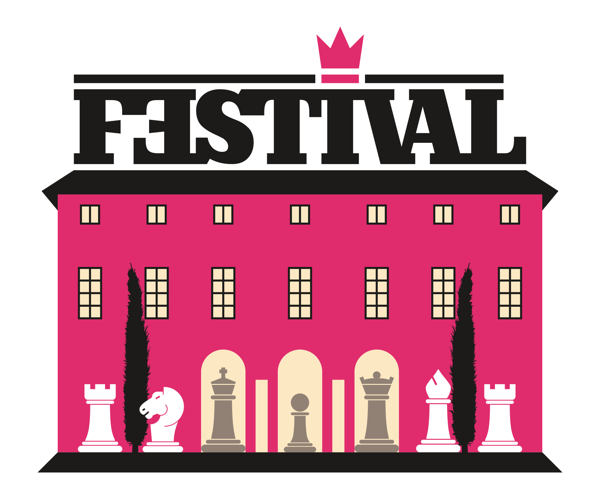

# 37. Festival "Comune di Robecchetto con Induno"

### RÈGLEMENT

- La manifestation, réalisée avec le patronage de la [commune de Robecchetto con Induno](http://www.commune.robecchetto-con-induno.mi.it/) et la contribution de la [société Ecologica Naviglio](http://www.ecologicanaviglio.it), comprend trois tournois d'échecs valides pour la mise à jour du score Elo Standard FIDE.
- Les trois tournois se déroulent avec le système suisse à six rondes. Chaque joueur pourra demander une nulle à forfait selon les modalités définies par le RTF de la FSI.
- Voici les critères de départage adoptés : REP (rondes où l'on a choisi de jouer), Buchholz cut 1, Sonneborn-Berger et A.R.O. Aux seules fins de ce dernier départage technique, l'Elo Italia est équivalent à l'Elo FIDE.

### CALENDRIER DE JEU

<table>
  <tr>
    <th>DATE</th>
    <th>MAGISTRAL & OPEN FIDE A</th>
    <th>OPEN FIDE B</th>
  </tr>
  <tr>
    <th rowspan="3">Vendredi 26 décembre 2025</th>
    <td>15:15 - clôture des inscriptions et contrôle des présences</td>
    <td>14:30 - clôture des inscriptions et contrôle des présences</td>
  </tr>
  <tr>
    <td>16:00 - 1ère ronde</td>
    <td>15:15 - 1ère ronde</td>
  </tr>
  <tr>
    <td></td>
    <td>17:30 - 2ème ronde</td>
  </tr>
  <tr>
    <th rowspan="3">Samedi 27 décembre 2025</th>
    <td>09:30 - 2ème ronde</td>
    <td>10:30 - 3ème ronde</td>
  </tr>
  <tr>
    <td>15:00 - 3ème ronde</td>
    <td>14:15 - 4ème ronde</td>
  </tr>
  <tr>
    <td></td>
    <td>16:30 - 5ème ronde</td>
  </tr>
  <tr>
    <th rowspan="3">Dimanche 28 décembre 2025</th>
    <td>09:30 - 4ème ronde</td>
    <td>10:30 - 6ème ronde</td>
  </tr>
    <tr>
    <td></td>
    <td>À la fin - Remise des prix</td>
  </tr>
    <tr>
    <td colspan="2" align="center">14:45 - Open Semi-rapide</td>
  </tr>
  <tr>
    <th rowspan="3">Lundi 29 décembre 2025</th>
    <td>09:30 - 5ème ronde</td>
    <td></td>
  </tr>
  <tr>
    <td>15:00 - 6ème ronde </td>
    <td></td>
  </tr>
    <tr>
    <td>À la fin - Remise des prix</td>
    <td></td>
  </tr>
  <tr>
    <td colspan="3">
      Le joueur qui atteindra l'échiquier avec plus de 30 minutes de retard sur l'horaire de début établi de la session de jeu perdra la partie.
    </td>
  </tr>
</table>

### REMBOURSEMENTS DE FRAIS ET AUTRES PRIX

<table>
  <tr>
    <th>CLASSEMENT</th>
    <th>MAGISTRAL</th>
    <th>OPEN FIDE A</th>
    <th>OPEN FIDE B</th>
  </tr>
  <tr>
    <td><b>1er</b></td>
    <td>300,00€ + coupe</td>
    <td>150,00€ + coupe</td>
    <td>120,00€ + coupe</td>
  </tr>
  <tr>
    <td><b>2ème</b></td>
    <td>200,00€ + coupe</td>
    <td>100,00€ + coupe</td>
    <td>80,00€ + coupe</td>
  </tr>
  <tr>
    <td><b>3ème</b></td>
    <td>150,00€ + coupe</td>
    <td>70,00€ + coupe</td>
    <td>60,00€ + coupe</td>
  </tr>
  <tr>
    <td><b>4ème</b></td>
    <td>100,00€</td>
    <td>50,00€</td>
    <td>40,00€</td>
  </tr>
  <tr>
    <td><b>5ème-6ème</b></td>
    <td>75,00€</td>
    <td>35,00€</td>
    <td>paquet de produits alimentaires</td>
  </tr>
  <tr>
    <th>PRIX DE CATÉGORIE (*)</th>
    <th>MAGISTRAL</th>
    <th>OPEN FIDE A</th>
    <th>OPEN FIDE B</th>
  </tr>
  <tr>
    <td><b>1er &lt;2000</b></td>
    <td>60,00€</td>
    <td></td>
    <td></td>
  </tr>
  <tr>
    <td><b>2ème-3ème &lt;2000</b></td>
    <td>50,00€</td>
    <td></td>
    <td></td>
  </tr>
  <tr>
    <td><b>1er plus de 65 ans</b></td>
    <td>paquet de produits alimentaires</td>
    <td>paquet de produits alimentaires</td>
    <td>paquet de produits alimentaires</td>
  </tr>
  <tr>
    <td><b>1ère femme</b></td>
    <td></td>
    <td></td>
    <td>coupe à la mémoire de Graziella Monzeglio</td>
  </tr>
  <tr>
    <td colspan="4">(*) non cumulables</td>
  </tr>
</table>

### INFORMATIONS ET INSCRIPTIONS

<table>
  <tr>
    <td></td>
    <th>MAGISTRAL & OPEN FIDE A</th>
    <th>OPEN FIDE B</th>
  </tr>
  <tr>
    <th>Frais d'inscription</th>
    <td>50,00€ (gratuit pour les joueurs avec Elo Standard &gt; 2299)</td>
    <td>35,00€</td>
  </tr>
  </table>

- 5,00€ de réduction non cumulables pour les vétérans (nés avant le 31.12.1960), les femmes et les joueurs nés après le 31.12.2006.
- 5,00€ de réduction supplémentaires pour les membres du club organisateur.
- Pré-inscription requise par téléphone ou en remplissant le <a href="https://vesus.org/event/???" target="_blank">formulaire</a> approprié sur VeSus avant le 22 décembre.

<table>
  <tr>
    <th>Responsable</th>
    <th>Mobile</th>
    <th>Courrier électronique</th>
  </tr>
  <tr>
    <td>Simone Rolfi</td>
    <td>+39&nbsp;3465755408</td>
    <td><a href="mailto:info@cavalliesegugi.com">info@cavalliesegugi.com</a>
    </td>
  </tr>
</table>

### LIEU DE JEU

Hôtel Restaurant DA MARIUCCIA via don Pozzi 43 à Malvaglio di Robecchetto con Induno.  
Avec Google Maps, suivez [ce lien](https://maps.app.goo.gl/EJ17uT26dPER2tYz7) ou saisissez le Plus Code **GQGJ+FR**.

- Tél. 0331 875546
- Fax: 0331 876133
- Site web: <a href="http://www.damariuccia.it" target="_blank">http://www.damariuccia.it</a>
- Il est interdit de fumer dans la salle de jeu.
- L'organisation se réserve le droit d'accepter un <strong>maximum de 132 inscriptions</strong>. Cependant, cette limite pourra être augmentée si le lieu de jeu le permet.
- Il est possible d'apporter des téléphones portables (comme d'autres instruments électroniques) dans la zone de tournoi seulement à condition qu'ils soient complètement éteints et restent physiquement séparés des joueurs (par ex. dans un sac) ; dans le cas contraire, l'arbitre appliquera les sanctions prévues par le règlement FIDE.

### TEMPS DE RÉFLEXION

<table>
  <tr>
    <th>MAGISTRAL</th>
    <th>OPEN FIDE A</th>
    <th>OPEN FIDE B</th>
  </tr>
  <tr>
    <td>100' + 30" bonus (modalité Fischer)</td>
    <td>100' + 30" bonus (modalité Fischer)</td>
    <td>50' + 10" bonus (modalité Fischer)</td>
  </tr>
  </table>

### ADMISSIONS

  <table>
    <tr>
    <th>MAGISTRAL</th>
    <th>OPEN FIDE A</th>
    <th>OPEN FIDE B</th>
  </tr>
  <tr>
    <td>Elo &gt; 1899</td>
    <td>Elo &lt; 2000</td>
    <td>Elo &lt; 1700</td>
  </tr>
  </table>

 - Les joueurs italiens résidant partout et les étrangers résidant en Italie doivent être en possession d'une licence agonistique ou jeune en cours de validité. Il sera possible de prendre une licence dans notre club lors de l'inscription au tournoi.
- Les joueurs étrangers sans numéro FIDE ID (FIN) ne seront pas admis.

Pour tout ce qui n'est pas prévu dans le présent règlement-appel d'offres, les normes du Règlement International de la FIDE et du Règlement Technique de la FSI en vigueur s'appliquent. L'inscription à la manifestation implique l'acceptation totale et inconditionnelle du règlement-appel d'offres et d'éventuelles modifications qui s'avéreraient nécessaires pour le bon déroulement de la manifestation.

### PALMARÈS

<table>
<tbody>
<tr>
<th>Édition</th>
<th>Date</th>
<th>Pays</th>
<th>Vainqueur</th>
<th>Participants</th>
</tr>
<tr>
<th>1</th>
<td>26-31/12/1988</td>
<td>🇮🇹</td>
<td>Valerio Luciani (VR)</td>
<td>46</td>
</tr>
<tr>
<th>2</th>
<td>26-31/12/1990</td>
<td>🇮🇹</td>
<td>Enzo Bove (CO)</td>
<td>58</td>
</tr>
<tr>
<th>3</th>
<td>26-31/12/1991</td>
<td>🇳🇱</td>
<td>Wim Koster (NED)</td>
<td>103</td>
</tr>
<tr>
<th>4</th>
<td>26-31/12/1992</td>
<td>🇮🇹</td>
<td>Fabio Bellini (VA)</td>
<td>95</td>
</tr>
<tr>
<th>5</th>
<td>26-30/12/1993</td>
<td>🇧🇦</td>
<td>Sahbaz Nurkic (BIH)</td>
<td>128</td>
</tr>
<tr>
<th>6</th>
<td>27-30/12/1994</td>
<td>🇮🇹</td>
<td>Fabio Bellini (VA)</td>
<td>117</td>
</tr>
<tr>
<th>7</th>
<td>22-25/06/1995</td>
<td>🇷🇸</td>
<td>Milorad Vujovic (YUG)</td>
<td>90</td>
</tr>
<tr>
<th>8</th>
<td>24-30/06/1996</td>
<td>🇭🇷</td>
<td>Milan Mrdja (CRO)</td>
<td>100</td>
</tr>
<tr>
<th>9</th>
<td>04-12/01/1997</td>
<td>🇮🇹</td>
<td>Alberto Colombo (VA)</td>
<td>72</td>
</tr>
<tr>
<th>10</th>
<td>26-29/06/1997</td>
<td>🇭🇷</td>
<td>Ante Jurkovic (CRO)</td>
<td>106</td>
</tr>
<tr>
<th>11</th>
<td>02-05/01/1998</td>
<td>🇮🇹</td>
<td>Davide Sgnaolin (VA)</td>
<td>76</td>
</tr>
<tr>
<th>12</th>
<td>02-05/01/1999</td>
<td>🇷🇴</td>
<td>Georghe Ciolac (ROU)</td>
<td>102</td>
</tr>
<tr>
<th>13</th>
<td>02-05/01/2000</td>
<td>🇧🇬</td>
<td>Ventzislav Inkiov (BUL)</td>
<td>69</td>
</tr>
<tr>
<th>14</th>
<td>26-29/12/2002</td>
<td>🇮🇹</td>
<td>Emiliano Aranovitch (VA)</td>
<td>76</td>
</tr>
<tr>
<th>15</th>
<td>27-29/12/2004</td>
<td>🇭🇷</td>
<td>Milan Mrdja (CRO)</td>
<td>64</td>
</tr>
<tr>
<th>16</th>
<td>27-29/12/2005</td>
<td>🇷🇸</td>
<td>Zivojin Ljubisavljevic (SCG)</td>
<td>52</td>
</tr>
<tr>
<th>17</th>
<td>27-29/12/2006</td>
<td>🇷🇸</td>
<td>Andjelko Dragojlovic (SCG)</td>
<td>63</td>
</tr>
<tr>
<th>18</th>
<td>27-30/12/2007</td>
<td>🇮🇹</td>
<td>Angelo Damia (MI)</td>
<td>78</td>
</tr>
<tr>
<th>19</th>
<td>27-30/12/2008</td>
<td>🇵🇭</td>
<td>Rolly Martinez (PHI)</td>
<td>97</td>
</tr>
<tr>
<th>20</th>
<td>27-30/12/2009</td>
<td>🇮🇹</td>
<td>Emiliano Aranovitch (VA)</td>
<td>95</td>
</tr>
<tr>
<th>21</th>
<td>27-30/12/2010</td>
<td>🇮🇹</td>
<td>Loris Cereda (MI)</td>
<td>109</td>
</tr>
<tr>
<th>22</th>
<td>27-30/12/2011</td>
<td>🇮🇹</td>
<td>Francesco Rambaldi (MI)</td>
<td>102</td>
</tr>
<tr>
<th>23</th>
<td>27-30/12/2012</td>
<td>🇱🇹</td>
<td>Virginijus Dambrauskas (LTU)</td>
<td>106</td>
</tr>
<tr>
<th>24</th>
<td>27-30/12/2013</td>
<td>🇨🇺</td>
<td>Ren&eacute; Marcial Alonso Garcia (CUB)</td>
<td>96</td>
</tr>
<tr>
<th>25</th>
<td>26-29/12/2014</td>
<td>🇮🇹</td>
<td>Angelo Damia (MI)</td>
<td>111</td>
</tr>
<tr>
<th>26</th>
<td>24-26/07/2015</td>
<td>🇮🇹</td>
<td>Artem Gilevych (BO)</td>
<td>78</td>
</tr>
<tr>
<th>27</th>
<td>26-29/12/2015</td>
<td>🇭🇷</td>
<td>Milan Mrdja (CRO)</td>
<td>101</td>
</tr>
<tr>
<th>28</th>
<td>26-29/12/2016</td>
<td>🇮🇹</td>
<td>Marco Massironi (MI)</td>
<td>80</td>
</tr>
<tr>
<th>29</th>
<td>26-29/12/2017</td>
<td>🇮🇹</td>
<td>Stefano Yao (TO)</td>
<td>98</td>
</tr>
<tr>
<th>30</th>
<td>20-22/07/2018</td>
<td>🇮🇹</td>
<td>Sergejs Gromovs (FG)</td>
<td>103</td>
</tr>
<tr>
<th>31</th>
<td>26-29/12/2018</td>
<td>🇭🇷</td>
<td>Teo Tomulic (CRO)</td>
<td>110</td>
</tr>
<tr>
<th>32</th>
<td>26-29/12/2019</td>
<td>🇮🇳</td>
<td>J Sai Agni Jeevitesh (IND)</td>
<td>94</td>
</tr>
<tr>
<th>33</th>
<td>26-29/12/2021</td>
<td>🇪🇸</td>
<td>Bernat Serarols Mabras (ESP)</td>
<td>75</td>
</tr>
<tr>
<th>34</th>
<td>26-29/12/2022</td>
<td>🇭🇷</td>
<td>Milan Mrdja (CRO)</td>
<td>100</td>
</tr>
<tr>
<th>35</th>
<td>26-29/12/2023</td>
<td>🇮🇹</td>
<td>Marco Cattaneo (EE)</td>
<td>95</td>
</tr>
<tr>
<th>36</th>
<td>26-29/12/2024</td>
<td>🇱🇹</td>
<td>Zanas Nainys (CRO)</td>
<td>104</td>
</tr>
</tbody>
</table>